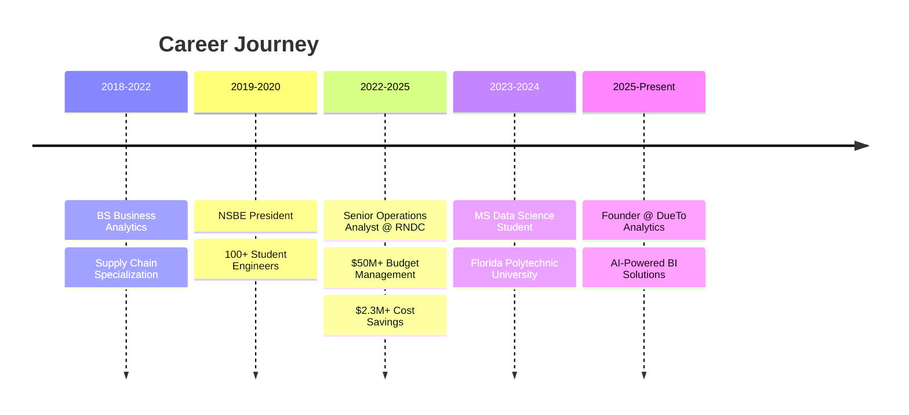

<!-- Animated Header Banner -->

<!-- Typing Animation -->

  <b>💼 Senior Operations Analyst @ RNDC</b> • <b>🎓 MS Data Science</b> • <b>🚀 Founder @ DueTo Analytics</b>

<!-- Key Metrics Bar -->

  
  
  
  

<!-- Profile Stats & Social -->

  
  
  

<!-- Enhanced Social Connect -->

  
  
  
  

---

<!-- Professional Introduction Section -->

## 👨‍💼 Who I Am

**Senior Operations Analyst** at **Republic National Distributing Company (RNDC)**, where I manage **$50M+ logistics budgets** and architect data solutions that drive **measurable business outcomes**. 

Recent grad with **MS in Data Science** at Florida Polytechnic University while serving as **President of NSBE Florida Poly Chapter**, leading a community of 100+ engineers toward professional excellence.

### 🎯 My Mission
> *"Transform complex data into strategic business advantages through analytics, automation, and AI-powered innovation."*

### 💼 What Sets Me Apart

<table>
<tr>
<td width="50%">

**💰 Proven Business Impact**
- Delivered **$2.3M+ in cost savings** through data-driven optimization strategies
- Reduced operational inefficiencies by **35%** via analytics-driven process improvements
- Identified **$1.2M revenue opportunity** through predictive demand modeling

</td>
<td width="50%">

**🏗️ Large-Scale Engineering**
- Built & maintain **ETL pipelines** processing **500K+ monthly transactions**
- Architected enterprise **Power BI dashboards** serving C-suite decision-makers
- Managed **$50M+ operational budgets** with data-backed KPI frameworks

</td>
</tr>
<tr>
<td width="50%">

**🚀 Entrepreneurial Drive**
- Founded **DueTo Analytics** - AI-powered analytics consultancy for SMBs
- Developed **market intelligence frameworks** for mobile tire service venture
- Building **autonomous BI agents** that create insights without human intervention

</td>
<td width="50%">

**👥 Leadership & Community**
- **President**, NSBE Florida Poly (100+ engineering students)
- Mentor for aspiring data professionals transitioning careers
- Speaker on analytics strategy & entrepreneurship

</td>
</tr>
</table>

---

## 🎓 Education & Certifications

| 🎯 Degree/Cert | 🏫 Institution | 📅 Year | 🌟 Highlights |
|----------------|----------------|---------|---------------|
| **MS in Data Science** | Florida Polytechnic University | 2024-2026 | Machine Learning • Advanced Analytics • Cloud Computing |
| **BS in Business Analytics** | Florida Polytechnic University | 2018-2022 | Supply Chain Focus • Data Modeling • Statistical Analysis |
| **AWS Cloud Practitioner** | Amazon Web Services | 2024 | Cloud Architecture • Data Pipeline Design |
| **Power BI Data Analyst** | Microsoft | 2023 | Advanced DAX • Data Modeling • Enterprise BI |
| **Python for Data Science** | IBM/Coursera | 2023 | Pandas • NumPy • Scikit-learn • Machine Learning |

---

## 🚀 Featured Projects & Case Studies

### 🏆 High-Impact Professional Work

<table>
<tr>
<td width="50%" valign="top">

#### 📊 **RNDC Operations Dashboard**
**Impact:** $2.3M+ cost savings | 35% efficiency gain

Designed enterprise-grade **Power BI dashboards** integrating cost, logistics, and performance data across 15+ distribution centers. Automated **real-time KPI tracking** for executive decision-making.

**Key Achievements:**
- Identified $2.3M in cost-saving opportunities through anomaly detection
- Reduced reporting time from 40 hours/week to 2 hours/week
- Enabled predictive maintenance saving $400K annually

**Tech:** Power BI • SQL Server • Python • DAX • Azure

🔗 [View Case Study](https://github.com/mcadetxx/rndc-dashboard) • 📈 [Live Demo](https://app.powerbi.com/...)

</td>
<td width="50%" valign="top">

#### 🤖 **DueTo Analytics AI Agent**
**Status:** Active Development | Beta Q1 2026

Building an **autonomous AI analytics platform** that generates business insights, creates dashboards, and provides strategic recommendations without human intervention.

**Innovation:**
- Natural language query interface for non-technical users
- Auto-generates visualizations from unstructured data
- Predictive insights with confidence intervals
- Integration with Snowflake, PostgreSQL, Excel

**Tech:** Python • LangChain • OpenAI • React • Streamlit • Snowflake

🔗 [GitHub Repo](https://github.com/mcadetxx/dueto-analytics) • 🌐 [Website](https://duetoanalytics.com)

</td>
</tr>
<tr>
<td width="50%" valign="top">

#### 💹 **AI Investment Portfolio Assistant**
**Impact:** Automated 40+ hours/month of analysis

AI-powered system for **real-time portfolio tracking** across stocks, crypto, and commodities. Provides automated performance reports, risk analysis, and strategic recommendations.

**Features:**
- Multi-asset class analysis (stocks, crypto, commodities)
- Automated risk/reward calculations
- Weekly performance summaries with AI insights
- Integration with Alpaca, CoinGecko APIs

**Tech:** Python • OpenAI API • Pandas • Streamlit • PostgreSQL

🔗 [Live Demo](https://investment-ai-demo.streamlit.app/) • 📊 [Documentation](https://github.com/mcadetxx/investment-ai)

</td>
<td width="50%" valign="top">

#### 📈 **Predictive Sales Forecasting Model**
**Accuracy:** 92% | **Business Value:** $1.2M revenue opportunity

Machine learning model predicting **demand across 50+ product categories** using time-series analysis and regression techniques. Deployed into production ETL pipeline.

**Business Impact:**
- Identified $1.2M revenue opportunity through demand prediction
- Reduced inventory waste by 28%
- 92% prediction accuracy on 3-month horizon

**Tech:** Python • Scikit-learn • Prophet • Pandas • SQL • Tableau

🔗 [GitHub](https://github.com/mcadetxx/sales-forecast) • 📄 [Technical Paper](https://...)

</td>
</tr>
<tr>
<td width="50%" valign="top">

#### 🚗 **Mobile Tire Service Market Analysis**
**Finding:** 12% untapped market opportunity

Comprehensive **market intelligence framework** for mobile tire service venture in Dallas-Fort Worth. Data-driven feasibility study with financial projections and competitive analysis.

**Research Deliverables:**
- Identified 12% market gap in fleet services
- Built financial model showing profitability by month 6
- Competitive positioning strategy using Porter's Five Forces
- 90-day launch roadmap with KPIs

**Tech:** Excel • Power BI • SQL • Python (Pandas) • Market Research

🔗 [Executive Summary](https://github.com/mcadetxx/mobile-tire-analysis)

</td>
<td width="50%" valign="top">

#### 🌱 **IoT Plant Monitoring System**
**Status:** Personal Project | Deployed

Arduino-based **smart plant monitoring system** with soil moisture sensors, automated watering, and mobile alerts. Integrates with cloud dashboard for remote monitoring.

**Technical Implementation:**
- Real-time sensor data collection (moisture, temperature, light)
- Automated watering based on ML-trained thresholds
- Cloud dashboard with historical trends
- Mobile push notifications

**Tech:** Arduino • C++ • Python • MQTT • Firebase • React Dashboard

🔗 [GitHub](https://github.com/mcadetxx/iot-plant-monitor) • 📷 [Build Photos](https://...)

</td>
</tr>
</table>

---

## 💼 Professional Experience Timeline

---

## 🛠️ Technical Arsenal

### 💻 **Programming Languages**

### 📊 **Business Intelligence & Analytics**

### 🧠 **Data Science & ML**

### ☁️ **Cloud & Data Infrastructure**

### 🌐 **Web & Application Development**

### 🔧 **Tools & Platforms**

---

## 📊 GitHub Performance Analytics

---

## 🏆 GitHub Achievements

---

## 🎯 Current Focus & Active Work

<table>
<tr>
<td width="50%" valign="top">

### 🔭 **What I'm Building Now**

#### 🤖 **DueTo Analytics (Q1 2026 Launch)**
Autonomous AI analytics agent for SMBs
- Natural language business intelligence
- Auto-generating dashboards & insights
- No-code analytics for non-technical founders
- **Tech:** Python, LangChain, React, Snowflake

#### 💹 **Investment AI Portfolio Tracker**
Real-time multi-asset portfolio management
- Automated performance tracking
- AI-generated market insights
- Risk/reward optimization suggestions
- **Tech:** Python, OpenAI API, Streamlit

#### 🌱 **IoT + BI Integration Projects**
Smart sensors connected to cloud dashboards
- Plant monitoring with automated watering
- Home energy consumption analytics
- **Tech:** Arduino, MQTT, Firebase, Python

#### 💼 **Career Advancement**
Targeting senior data science roles
- **Range:** $100K-$150K
- **Focus:** Analytics leadership, ML engineering
- **Location:** Remote or Dallas/Fort Worth

</td>
<td width="50%" valign="top">

### 👯 **Open to Collaborate On**

#### 📊 **Enterprise Analytics Projects**
- Power BI/Tableau dashboard development
- ETL pipeline architecture & optimization
- Data warehouse design (Snowflake, Redshift)
- Automated reporting systems

#### 🤖 **AI/ML Applications**
- Predictive modeling for business forecasting
- NLP for business intelligence automation
- Computer vision for inventory/logistics
- Recommendation systems

#### 🚀 **Startup & Entrepreneurship**
- Data strategy consulting for early-stage startups
- Go-to-market analysis using data intelligence
- MVP development with analytics infrastructure
- Technical co-founder opportunities

#### 📚 **Knowledge Sharing**
- Speaking engagements on data careers
- Mentoring aspiring data professionals
- Workshop facilitation (analytics, Python, BI)
- Career transition coaching (→ data science)

#### 💬 **Let's Talk About:**
Data Analytics • Operations Optimization • Business Intelligence  
ETL Architecture • Machine Learning • Supply Chain Analytics  
Entrepreneurship • Career Growth • Investment Strategy • Tech Leadership

</td>
</tr>
</table>

---

## 🌟 Life Beyond Code

### 🎭 **How I Recharge & Stay Balanced**

<table align="center">
<tr>
<td align="center" width="20%">
 
<b>Combat Sports</b> 
Boxing 🥊 Martial Arts Training Competitive Sports
</td>
<td align="center" width="20%">
 
<b>Team Athletics</b> 
Soccer ⚽ • Basketball 🏀 Tennis 🎾 • Football 🏈 Golf ⛳
</td>
<td align="center" width="20%">
 
<b>Outdoor Adventures</b> 
Fishing 🎣 • Biking 🚴 Running 🏃 • Camping 🏕️ Hiking 🥾
</td>
<td align="center" width="20%">
 
<b>Financial Growth</b> 
Building Portfolio 💹 Market Research 📈 Investment Strategy 💰
</td>
<td align="center" width="20%">
 
<b>Continuous Learning</b> 
Technical Books 📚 Arduino Projects 🔧 Online Courses 🎓
</td>
</tr>
</table>

 

**⚡ Fun Fact:** *I'm building a mobile tire service business while optimizing $50M+ in logistics operations—proving that data skills translate across any industry. When I'm not crunching numbers, you'll find me in the boxing ring or analyzing market trends for my investment portfolio!* 🥊📊💰

---

## 💬 Let's Connect & Build Together

### 🤝 **I'm Most Valuable When Discussing:**

**📊 Data Strategy & Analytics** • **🔄 Operations Optimization** • **🤖 AI/ML Applications**  
**💼 Business Intelligence** • **🚀 Startup Analytics** • **📈 Investment Research**  
**💡 Career Transitions** • **👥 Leadership & Mentorship**

 

### 📫 **How to Reach Me**

 

  

### 🎯 **Looking For:**
- **Senior Data Science/Analytics Roles** ($100K-$150K range)
- **Technical Co-Founder** opportunities in analytics/AI space
- **Consulting Projects** for data-driven business optimization
- **Speaking Engagements** on analytics, entrepreneurship, career transitions

---

## 💭 Daily Inspiration

---

## 🐍 Contribution Streak Visualized

  

---

<!-- Professional Footer -->

**⭐ If my work resonates with you, consider starring my repositories!**

*Building at the intersection of data science, operations excellence, and entrepreneurial innovation*

 

